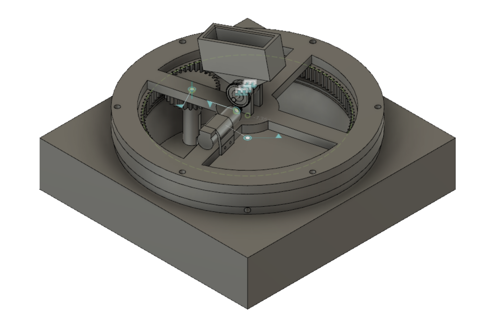

# ME405-TermProject
## Introduction
Our device is a Nerf turret that can rotate 180+ degrees, locate targets using a 
thermal camera, and accurately fire foam darts. Its purpose is purely 
recreational, providing a high-tech edge to Nerf battles. Our target market is 
college-aged students who want to upgrade their own Nerf turrets for an even 
more exciting experience.
## Hardware Design
To create our hardware, we had to consider several factors. The most important 
considerations were the gear ratios, the mechanism to rotate the gun about each 
axis, and the triggering mechanism.

To calculate the gear ratios, we took into account the torque output of the tub 
motors and the built-in 16:1 gear ratio. We also considered the torque 
requirement for each axis of rotation. In the end, we settled on a gear ratio of 
4 for each axis.

For rotation about the z-axis, we used a 12-inch turntable. Pitch rotation was 
achieved through a magazine holder that was directly attached to the gun and held 
the magazine.

The triggering mechanism was made up of two motors housed within the nerf gun 
that spun disks to launch the nerf darts. To fire the dart, we used a relay to 
connect the motors to a power supply. At the same time, a solenoid pushed the 
dart into the spinning disks to launch it.

## Electronic Design
The electronics of the turret were split into 3 main subcategories; the motors 
for the pitch and yaw, the motorized wheels in the nerf gun which launch the 
dart, and the solenoid which pushes the darts into wheels. The pitch and yaw 
motors were controlled by the MCU directly, but the wheels and solenoid were 
designed to be controlled with electronic switching devices such as transistors 
or relays, since they required more power than the MCU was able to output.

One of the main issues with our electrical subsystems was our inexperience with 
designing circuits for and using electronic switching devices. The parts were 
either not able to handle the power flowing through them, or we were not 
providing enough voltage to actually switch them on.

### CAD Design

### Final Turret

## Software Design
The software for this project is designed to implement four tasks which control
the motion and firing of the automated nerf turret. The Get Target task 
interfaces with the thermal camera and processes the data so that it can be 
interpreted by the motors. The Motor Pitch and Motor Yaw tasks control the pitch
and yaw motors, respectively. Lastly, the Shoot task controls the triggering of
the turret. The Doxygen generated documentation for our software provides much 
more detail about each task.

Several key variables are passed between the tasks to dictate the action of the
turret. Most of the variables shown in the following finite state machines (FSM)
are flags that either can hold either a 1 or a 0. The current pitch, current 
yaw, target pitch, and target yaw variables store values in units of encoder 
ticks.
## Tasks and States - Diagrams
### Task Diagram

### Get Target Task FSM

### Motor Pitch Task FSM

### Motor Yaw Task FSM

### Shoot Task FSM

## Results
We decided to test our system in the spirit of the Wild West: with a good old-
fashioned duel. During this test, we were pleased to see that our turret was 
able to rotate 180 degrees without any issues. The device seemed to also focus 
in on a target on occasion, but not consistently. We feel that our algorithm for
finding the optimal target seems reasonable, and that the period and priority of
the tasks could be the cause for our inconsistent target acquisition. 

Unfortunately, our pitch axis was unable to drive the gun properly due to the 
solenoid's excessive weight, which was not accounted for in our initial design. 
The gear ratio for the pitch axis was far too small, as was the set screw 
holding the magazine of the gun to the motor shaft. 

We initially used a 12 V battery pack to power the solenoid, but the battery 
pack could not provide enough current to fully extend the solenoid plunger. We 
then wired a second 12 V battery pack in parallel which did provide enough 
current, but caused our power transistor to smoke. As a final effort to get our 
outrageously large solenoid to work, we attempted to use a relay instead of a 
power transistor, but we could not manage to finish the circuit.

We found it challenging to test our software without functioning hardware, so 
there may be a few bugs.

## Conclusion
We learned that our device is very successful in quick rotation about the 
z-axis, but considerable improvements are needed for the pitch axis and 
triggering mechanism. The gears on the pitch axis ended up rotating away from 
one another due to the unstable mounting bracket used for the corresponding 
motor. That being said, we did see success with the mounting of the thermal 
camera in relation to the ability to collect good data. We also feel that we 
wrote an appropriate and efficient algorithm for target acquisition from the 
camera.

Most of the issues we faced with the implementation of our design was traceable to poor design decisions made early on in the process. We decided to attempt to actuate
the nerf gun as it was intended, as opposed to allowing ourselves greater freedom in modifying the device. Had we made proper use of the project design principles and
procedures we have been taught, we could have avoided this outcome. Our choice led to us choosing a solenoid with a 1.5 inch stroke out of necessity, which caused us
no end of trouble, such as the weight and power issues detailed in the results section of this report. 

A more elegant solution would have been to use a smaller solenoid attached to a series of levers to multiply it's travel distance, or a similar setup with a servo
motor.

There are a few things that we recommend improving with the next iteration of 
this nerf turret. First off, the turntable can be sized down considerably to 
create a smaller base and use less material. More importantly, however, a servo 
motor should take the place of the oversized solenoid. It seemed that our most 
successful competitors implemented this approach, and we too recommend it. 
Additionally, we recommend using a higher gear ratio on the pitch axis along 
with larger gears. 
