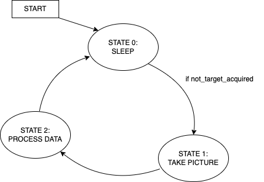

# ME405-TermProject
## Introduction
Our device is a Nerf turret that can rotate 180 degrees, locate targets using a thermal camera, and accurately fire foam darts. Its purpose is purely recreational, providing a high-tech edge to Nerf battles. Our target market is college-aged students who want to upgrade their own Nerf turrets for an even more exciting experience.
## Hardware Design
To create our hardware, we had to consider several factors. The most important considerations were the gear ratios, the mechanism to rotate the gun about each axis, and the triggering mechanism.

To calculate the gear ratios, we took into account the torque output of the tub motors and the built-in 16:1 gear ratio. We also considered the torque requirement for each axis of rotation. In the end, we settled on a gear ratio of 4 for each axis.

For rotation about the z-axis, we used a 12-inch turntable. Pitch rotation was achieved through a clip holder that was directly attached to the gun and held the clip.

The triggering mechanism was made up of two motors housed within the nerf gun that spun disks to launch the nerf darts. To fire the dart, we used a relay to connect the motors to a power supply. At the same time, a solenoid pushed the dart into the spinning disks to launch it.

## Software Design

## Tasks and States - Diagrams
### Task Diagram

### Get Target Task FSM

### Motor Pitch Task FSM

### Motor Yaw Task FSM

### Shoot Task FSM

## Results
We decided to test our system in the spirit of the Wild West: with a good old-fashioned duel. During this test, we were pleased to see that our turret was able to rotate 180 degrees without any issues. We also observed that it had a slight bias towards people detected by the thermal camera. To perfect this targeting, further filtering would be required.
Unfortunately, our pitch axis was unable to drive the gun properly due to the solenoid's excessive weight, which was not accounted for in our initial design. This misstep was the result of a breakdown in communication between our hardware and electrical teams. Furthermore, the solenoid was not supplied with sufficient power, which prevented it from actuating the darts. In fact, during a late-night production session, the solenoid even released some magic smoke from our breadboard.

## Conclusion
We learned that our device is very successful in quick rotation about the z-axis, but considerable improvements are needed for the pitch axis and triggering mechanism. The gears on the pitch axis ended up rotating away from one another due to the unstable mounting bracket used for the corresponding motor. That being said, we did see success with the mounting of the thermal camera in relation to the ability to collect good data. (The filtering of the data does need to be slightly tweaked).

There are a few things that we recommend improving with the next iteration of this nerf turret. First off, the turntable can be sized down considerably to create a smaller base and use less material (in case the device goes into full production). More importantly, however, a servo motor should take the place of the oversized solenoid. It seemed that our most successful competitors implemented this approach, and we too recommend it. Additionally, we recommend using a higher gear ratio on the pitch axis along with larger gears. 
